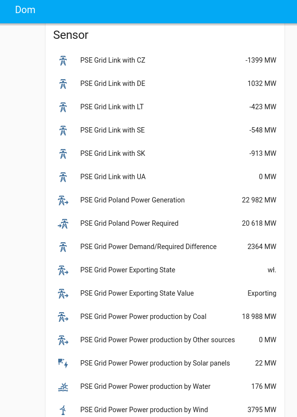

# ha_pse_grid_stat
## Home assistant Polish Energetic Grid Statistics

This is a custom component which provides Polish energetic statistics based on
https://www.pse.pl/dane-systemowe

## Installation

- Clone repository
- Put entire repository inside **custom_components** folder inside **config** directory in home assistant
- Restart Home Assistant
- Go to **Settings->Integrations** click on **Add Integration**
- Look for PSE Grid Stat

OR

Use HACS.xyz -> Add repository

## Screenshot

## License

MIT

**Free Software, Hell Yeah!**
